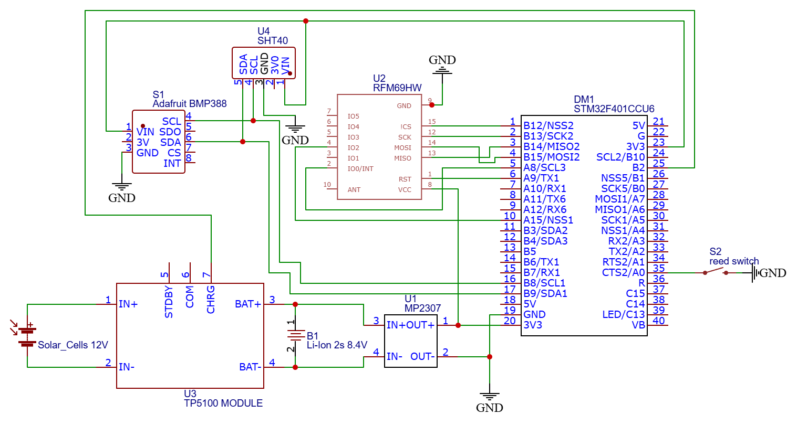

# Arduino based analog of Lacrosse TX141W Weather sensor

This is the DYI copy of TX141W outdoor sensor, that I placed inside of original wireless sensor.
It is build on components from local electronic store, but works as original device.
The signal, that is sent by device is recognized by main module as a native one. 

Few additional feautures that I implemented here:
* Solar panel powering
* Air pressure value is sent instead in a wind direction, since we don't have wind direction sensor in TX141W.

# Used modules

* BlackPill STM32F401 microcontroller
* RFM69HW Radio transmitter
* SHT41 Digital humidity and temperature sensor
* BMP388 24-bit air pressire and altitude sensor

# Some features

* Hardware Timers for counting pulses from Wind Speed sensor while MCU is in sleep mode. (injection of HAL code)
* Sleep and DeepSleep modes for MCU from **stm32duino/STM32duino Low Power** library
* Sleep mode for radio transmitter
* WatchDog timer
* Data transmission frequency depends on Li-Ion battery charge state.
* **robtillaart/RunningAverage** filters fake values from temperature sensor

Code base:
* **jgromes/RadioLib** managing RFM69 radio module on a hardware level
* **ropg/OOKwiz** how to properly send OOK PWM signal through RFM69
* **hdtodd/omnisensor_433** how to code OOK PWM signal

